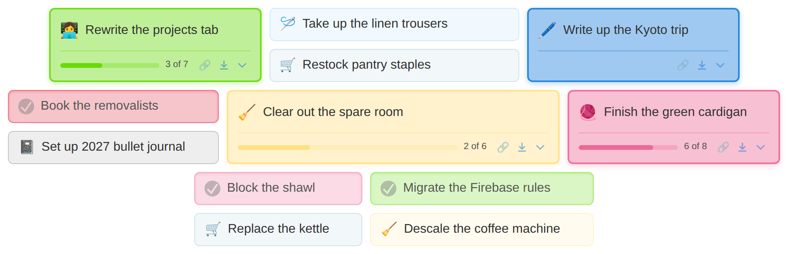
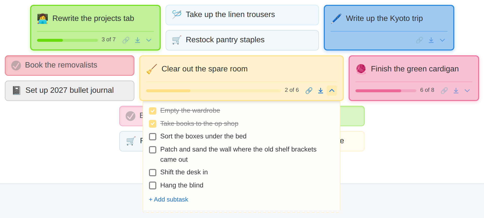

# Projects tab — shelf layout

Design for reworking the projects tab. **Agreed but not implemented** — nothing in
`src/` has changed. This document plus `prototype.html` are the whole output so far.





## The idea

Projects sit on a shelf as tiles of mixed size. A project's *vitality* — how alive
the work is — is carried by saturation, size, and whether it grows a second row.
Hue always means category and never means status, so status has to ride on
everything else.

Unstarted things are small, pale and single-line. Starting one makes it bloom: full
saturation, a second row, more room on the shelf. Finishing it doesn't remove it or
cross it out — it settles, keeps its colour, and trades its category emoji for a
tick. **Nothing ever changes position because its status changed.**

## Using the prototype

`prototype.html` is a standalone page — open it in a browser, no build step. Click a
chevron to feed the sheet out, click an emoji to cycle ready → in progress → done,
esc closes. Also published at
<https://claude.ai/code/artifact/ad2b87ce-8a5b-4e35-93e2-b69c5648f44d>.

It is a **visual reference only**. It renders by rebuilding `innerHTML`, animates
reordering with hand-rolled FLIP, and drives everything from one global array. None
of that should reach the React implementation — see *Pitfalls* below for the one
place where copying it would actually break the design.

## Card states

Hue comes from `PROJECT_COLOURS` and is decomposed into `--h`/`--s`/`--l` so alpha
and lightness can be varied per state.

| | ready | in progress | done |
|---|---|---|---|
| tint | `/ 0.13` | `/ 0.42` | `/ 0.24` |
| border | `1px` `/ 0.38` | `2px` `/ 0.9` | `1px` `/ 0.45` |
| height | `--small-h` | `--big-h` | `--small-h` |
| shadow | none | `0 2px 7px` outer | `inset 0 1px 3px` |
| rows | name only | name + meta | name only |
| icon slot | category emoji | category emoji | grey tick disc |

The meta row carries the progress bar, the actions (link-to-today, move-to-end) and
the expand chevron. **A card with no subtasks still gets a meta row but no progress
bar.** Small cards have no meta row, so they reveal a chevron on hover instead —
otherwise a ready project with subtasks would have no way to open.

Done cards get **no strikethrough and no grayscale**. Both throw away information:
strikethrough reads as cancelled rather than completed, and the old
`filter: grayscale(.5)` discarded the category exactly when scanning back over
finished work.

## The packing

Small cards are half the height of big ones, so a shelf of mixed sizes leaves ragged
vertical gaps. Fixed by pairing small cards into a stack that occupies one big-card
slot.

**The geometry rule** — everything else follows from this line:

```css
--small-h: 42px;
--shelf-gap: 10px;
--big-h: calc(var(--small-h) * 2 + var(--shelf-gap));
```

Every item on the shelf is then either one big-card-height or one
small-card-height, so rows come out flush. Card heights are *declared*, not derived,
which is why `box-sizing: border-box` is load-bearing here (the app already sets it
globally in `src/index.css`).

**Stacks.** Two small cards go into a wrapper that is a single flex item, so the
browser sees one big-card-shaped thing. The `.projects` flex-wrap shelf is otherwise
untouched — no grid, no masonry library.

**The pairing rule.** Walk the ordered list; big cards pass straight through; buffer
small ones and emit a stack every second one; a leftover odd one sits alone. Order is
preserved apart from a small card occasionally waiting for a partner.

Consequence: changing a project's status changes its size, which changes the pairing,
which shifts the cards after it. This is much gentler than the old status sort
(nothing leaves its place in the list) but it is not nothing. Worth watching in real
use.

Drag-and-drop between stacks is **not** a concern — the current implementation
doesn't support dragging between lists anyway.

## The sheet

Subtasks feed out of the bottom of the card like paper from a printer, over the top
of the cards below, rather than expanding the card. Because the sheet is out of flow,
**the shelf cannot reflow when something opens** — which is what killed the
hole-in-the-row problem the old inline expansion had.

Three offsets matter, and all three were wrong at some point:

```css
.paper-slot {
  position: absolute;
  top: calc(100% + var(--card-border));
  left: calc(var(--radius) - var(--card-border));
  right: calc(var(--radius) - var(--card-border));
  clip-path: inset(0 -40px -40px -40px);
}
```

- **`top`** — an absolutely positioned box resolves its offsets against the *padding*
  box, which excludes the border. Plain `top: 100%` lands one border-width short and
  the sheet covers the card's bottom border, which makes it read as a sheet laid on
  top rather than one coming out from underneath.
- **`left`/`right`** — inset to the straight run of the bottom border. The corners
  have already curved away by then, so a full-width sheet emerges past the ends of
  the slot.
- **`clip-path`** — while closed the sheet is parked a full height *up*, overlapping
  the card. The top edge must clip hard; the negative insets leave the sides and
  bottom open for its shadow.

The feed animation is two motions at once — the slot growing and the sheet sliding
out of it:

```css
.paper-slot { grid-template-rows: 0fr; transition: grid-template-rows .4s; }
.project.open .paper-slot { grid-template-rows: 1fr; }
.paper { transform: translateY(-100%); transition: transform .4s; }
.project.open .paper { transform: translateY(0); }
```

Details that sell it: a shaded leading edge (`inset 0 7px 7px -7px`) so the top looks
still tucked under the lip, and a torn bottom edge via a two-layer `mask`.

Long subtasks wrap. The checkbox is `align-items: flex-start` with a small top margin
so it centres on the *first* line rather than floating to the middle of a wrapped
block.

## Cards grow to fit their sheets

A card is sized by its name, but its sheet is sized by its subtasks — so a short name
with wordy subtasks gives a tall, narrow sheet. Since the sheet is out of flow it
contributes nothing to the card's width, so the width is measured and handed back:

set each sheet to `width: max-content`, read it, add the two corner radii, apply as
the card's `min-width`, capped at `--card-max` (currently `420px`). Done in three
passes — write all, read all, write all — so layout flushes twice rather than once
per card.

Two things to keep an eye on: at the cap a wide card with a short name leaves a long
empty run beside the name, and card widths end up driven by subtask text you can't
see (a ready card can be wide because of a hidden subtask, and stacks stretch to
their widest member so it pulls its partner along too). If that reads as arbitrary,
the softer version is to only fit `in_progress` cards.

## Colour values for the done state

```css
--tint-strength: 24%;
--done-ink: hsl(0 0% 34%);          /* project name */
--done-mark: hsl(0 0% 52% / 0.5);   /* tick disc */
--done-glyph: color-mix(in srgb, hsl(var(--h) var(--s) var(--l))
                        var(--tint-strength), hsl(0 0% 100%));
```

**Why 34% for the name.** It is the last value clearing WCAG AA (4.5:1) on every
category tint — 🚚 red is the tightest at 4.74:1, and one step lighter (42%) drops it
to 3.49:1.

**Why the disc is translucent.** A flat neutral grey is the only hue-neutral element
on a tinted shelf: correct on the 📓 grey card, foreign on the saturated ones. At
0.5 alpha the tint bleeds through and each disc lands on a grey of its own card's
hue. Tested as a matrix across all eight categories — above ~0.7 alpha it's
indistinguishable from opaque, and at 0.35 the disc gets so close to the card that
the tick starts vanishing on the *pale* categories (🧹, 🪡), which fail before the
saturated ones do.

**The lightness and the alpha are a pair.** 52% is deliberately darker than the
composite it produces, because half of what you see is the tint behind it. Change one,
change the other.

**The tick glyph is the card's exact background**, so it reads as cut out of the disc
rather than drawn on it. It shares `--tint-strength` with the tint itself, which is
what keeps them identical — verified numerically (🚚: `0.24 × 0.855 + 0.76 × 1 =
0.9652`, matching the glyph's red channel). Contrast here is deliberately ignored:
the disc replacing the emoji is itself the signal that the project is done, so the
tick doesn't have to carry it.

## Changes to existing code

**Delete the status sort** in `src/tabs/Projects/index.tsx:26-34`. Ordering becomes
position-only, so marking something done no longer yanks it out from under the
cursor. The existing move-to-end button covers the case where you do want it gone.

**`openProjectIds` becomes a single id.** `Project.tsx` currently persists a Set of
open projects to localStorage. Overlapping sheets would be a mess, so opening one
closes the others.

**Reuse what's already there.** `EmojiCheckbox` already takes `useTickForDone` and
renders `<DoneTick />` (`TodayTask.tsx:49` uses it). `DoneTick.css` hardcodes
`background: var(--success-colour)` and `DoneTick.tsx` hardcodes `colour="white"` —
both need to become overridable, or the svg's `stroke` set from CSS.

Keep using `Checkbox`, `EditableText`, `ButtonWithConfirmation`, `DragHandle` /
`DraggableListItem` as-is.

## Pitfalls

**The sheet must stay mounted.** A CSS transition needs a value to change on an
element already in the document; an element added in its final state just appears.
`Project.tsx:195` currently gates the subtask list behind `hasOpenedSubtasks &&`,
which flips true in the same update as `subtasksVisible` — so the first open of any
project mounts it already visible and doesn't animate. Barely noticeable today with a
small height change; with the printer sheet the animation *is* the effect. Render the
sheet unconditionally and let a class drive open/closed.

**The overlay gets clipped by a scrolling ancestor.** `.projects` currently gets a
JS-computed height (`index.tsx:36-42`). The moment that container gets
`overflow: auto`, an absolutely positioned sheet is cut off at its edge. Either the
container doesn't scroll, or the sheet is portalled out.

**Pre-existing:** `Project.tsx:130-138` calls `updateItem` during render to
auto-promote a project to `in_progress` when a subtask is done. That's a side effect
in a render body and this work sits directly on top of it.

## Settled — please don't reopen

These were considered and rejected during design:

- **A card grid**, or uniform full-width rows. The wrapping shelf of variable-width
  tiles stays.
- **Grouping or sectioning** by category or status. One flat list, all categories
  mixed.
- **Colour meaning status.** Hue is category, always.
- **Collapse-all / expand-all.**
- **Time-based decay** ("wilting" for untouched projects). The page is for keeping
  track of things to do, not for making you feel bad about not doing them.
- **The card background filling** as subtasks complete — a progress bar instead.
- **A coloured tick badge** at the end of a done card's row. It was invisible in
  practice.
